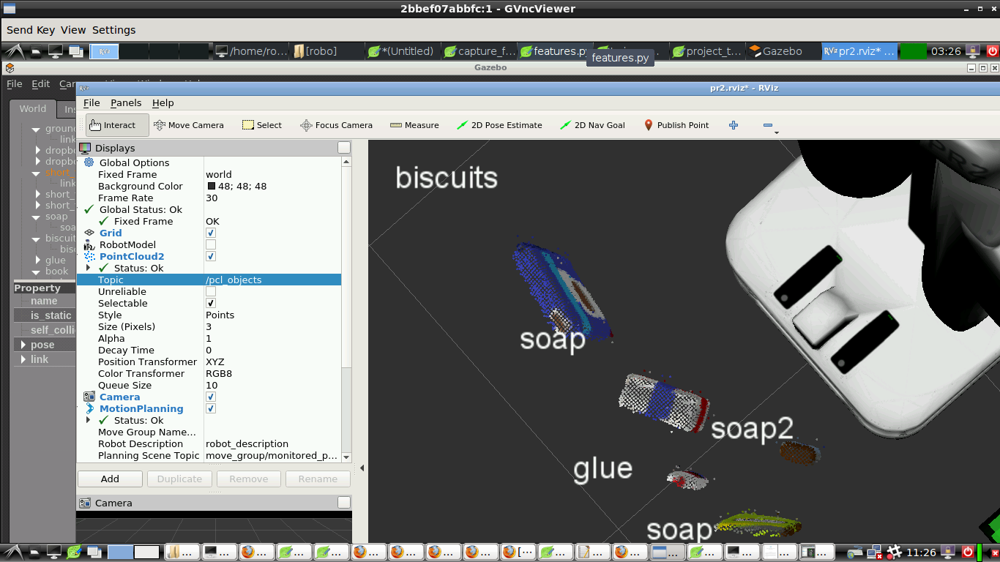
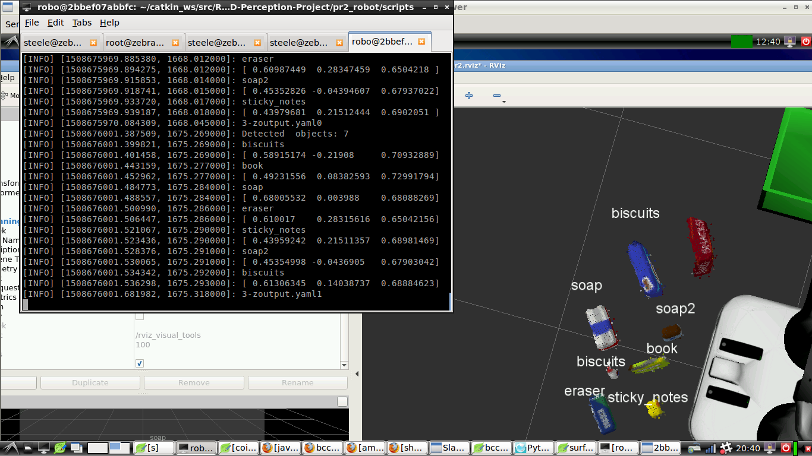
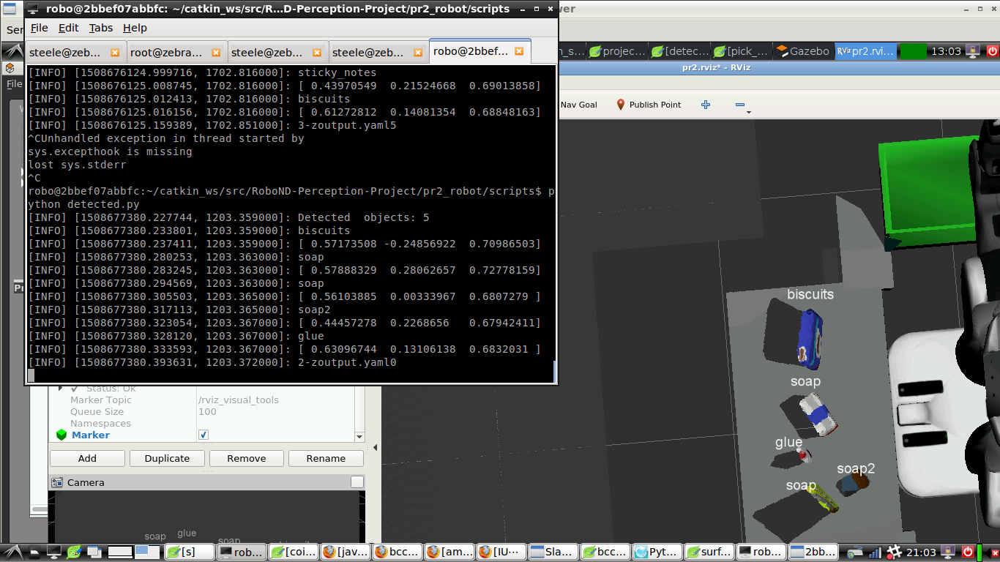
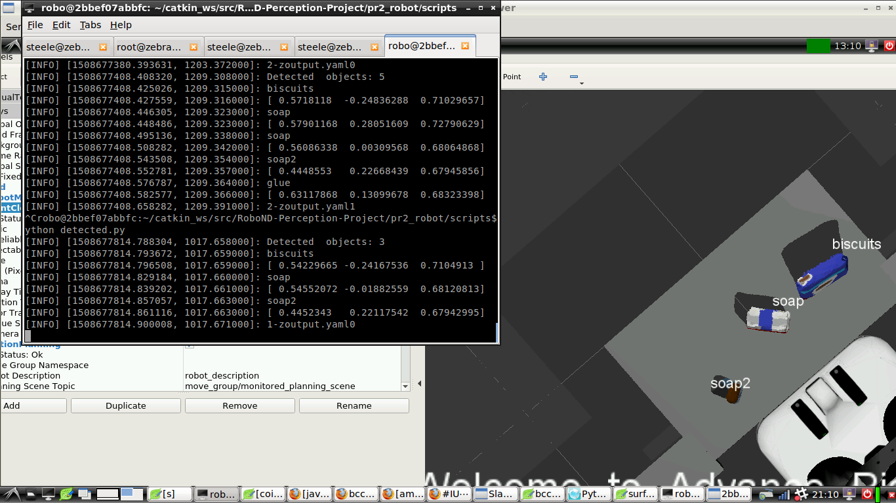

## Project: Perception Pick & Place

---

# Required Steps for a Passing Submission:
1. Extract features and train an SVM model on new objects (see `pick_list_*.yaml` in `/pr2_robot/config/` for the list of models you'll be trying to identify). 

## [Rubric](https://review.udacity.com/#!/rubrics/1067/view) Points
### Here I will consider the rubric points individually and describe how I addressed each point in my implementation.  

---
### Writeup / README

#### 1. Provide a Writeup / README that includes all the rubric points and how you addressed each one.  You can submit your writeup as markdown or pdf.  

Complete the code of  extracting features, also i've done with following change: statistical filtering, using HSV,  publishing the input cloud to svm

### Exercise 1, 2 and 3 pipeline implemented
#### 1. Complete Exercise 1 steps. Pipeline for filtering and RANSAC plane fitting implemented.

#### 2. Complete Exercise 2 steps: Pipeline including clustering for segmentation implemented.  

#### 2. Complete Exercise 3 Steps.  Features extracted and SVM trained.  Object recognition implemented.
 
[train the svm](./train-svm-sigmoid.png)

see scripts in my https://github.com/steelexu/RoboND-Perception-Exercises

### Pick and Place Setup

I've done above exercise  one month ago, and the trained model works well in the exercise scene ,using 20 iteration, but when I swith to the PR2 scene, the result is very poor.

Now I have to change the capture iteration from 20 to 100, no special improvements yet.
So when change to 500 iteration, in test2 world, the correct become 75%, except that it can't recognzie the book

#### 1. For all three tabletop setups (`test*.world`), perform object recognition, then read in respective pick list (`pick_list_*.yaml`). Next construct the messages that would comprise a valid `PickPlace` request output them to `.yaml` format.

In test2/3 world ,i'm using large bin size(64 for color,128 for norm), also 500 iteration

#### using another scripts to subscribe /detected_objects and  output the yaml, see detected.py

 

 

#### thinking
* why snack and book can not be recognized ?
* I doubt the downsampling input may effect the predction of SVM
* I tried sigmoid kernel, no improve, wondering linear is the best?

